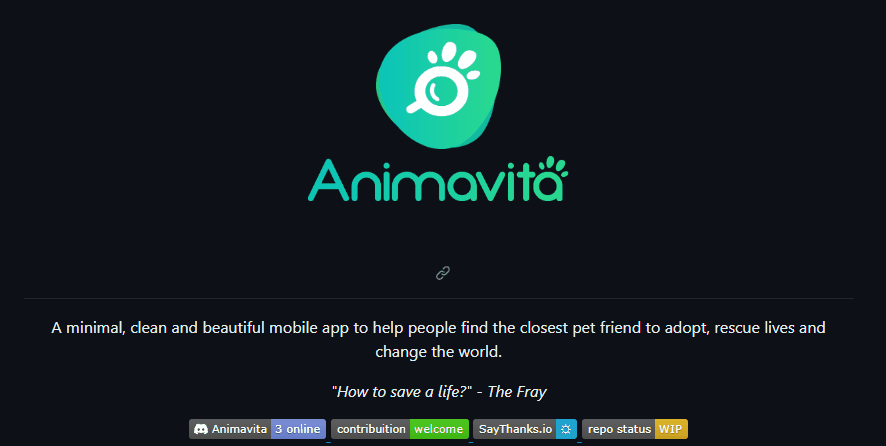

# Aprendendo a Trabalhar com o Readme 

Um projeto de teste com um arquivo Readme, para aprender como tudo se completa, como fazer as implementações 🐱‍👤 

[](https://github.com/animavita/animavita#dizzy-roadmap)

Clique na imagem e seja direcionado para o Gihub do <strong>Animavita</strong>;

## Exemplo de como estruturar as tecnologias utilizadas
- HTML   
- CSS  
- JS

## Como Utilizar
1 - Clone o projeto
```
git clone <url>
```

2 - Acesse a pasta do projeto
```
cd repositorio-readme
```